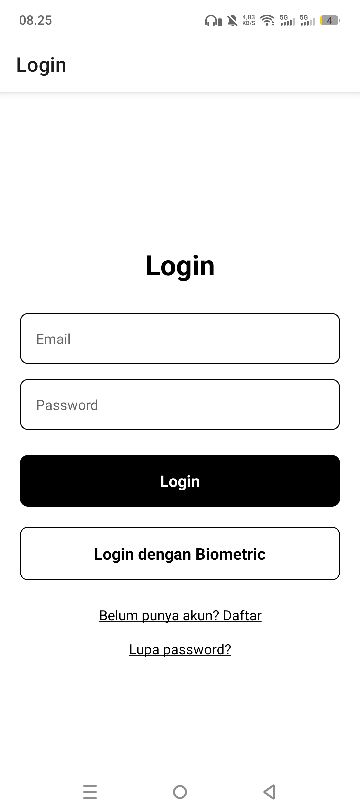
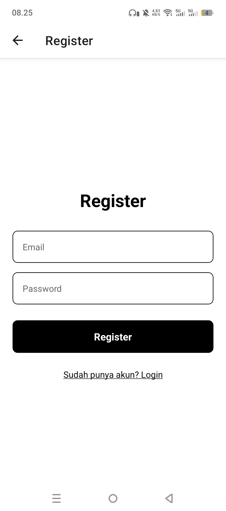
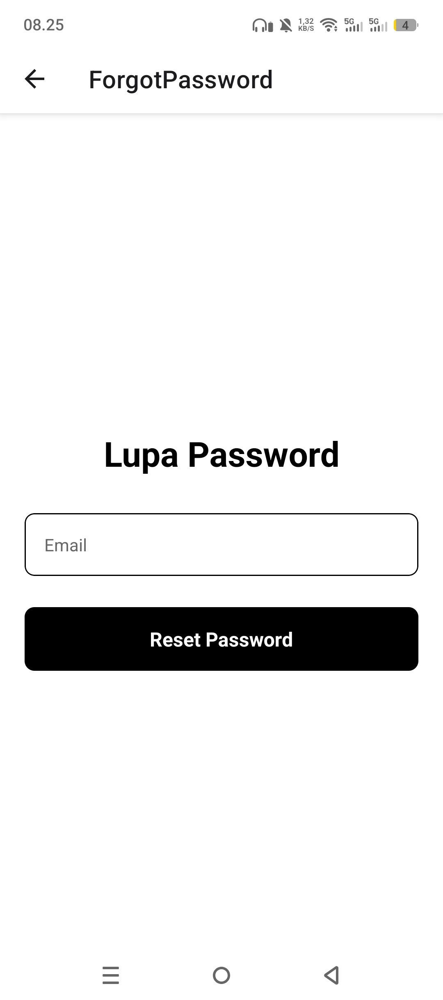
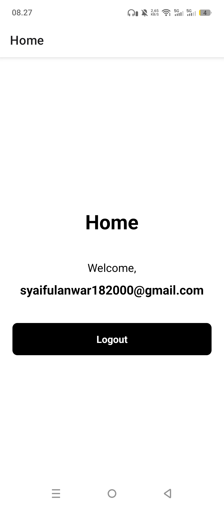

# Auth

## Informasi Mahasiswa

- Nama : Muhamad Zidan Rabani
- NIM : 2410501036
- Kelas : B

## Deskripsi Aplikasi

Aplikasi mobile berbasis React Native (Expo) yang mengimplementasikan sistem autentikasi lengkap menggunakan Firebase.

## Fitur Utama

- **Autentikasi Firebase**: Bisa daftar dan masuk menggunakan email dan password.
- **Proteksi Akses**: Membatasi halaman agar hanya bisa diakses setelah login.
- **Verifikasi Email**: Mengirim link ke email untuk memastikan akun asli.
- **Reset Password**: Mengirim link pemulihan ke email jika lupa password.
- **Login Biometrik**: Masuk lebih cepat dan aman pakai sidik jari.
- **Simpan Sesi Login**: Tidak perlu login ulang meskipun aplikasi ditutup.

## Fitur Pilihan

- **Auto Logout**: Otomatis keluar dari akun jika aplikasi didiamkan selama 5 menit.

## Screenshot

### Login Screen

<p align="center">
  
</p>

### Register Screen

<p align="center">
  
</p>

### Forgot Password Screen

<p align="center">
  
</p>

### Home Screen

<p align="center">
  
</p>

## Video demo

[Video Demo di Google Drive](https://drive.google.com/file/d/1xyAy8waylpgulQE1nSxj6shVvC8RpjCA/view?usp=sharing)

## Cara Menjalankan

1. Clone the repository:
   ```bash
   git clone https://github.com/Ampasan/auth-praktikum.git
   ```
2. Install dependencies:
   ```bash
   npm install
   ```
3. Start the development server:
   ```bash
   npx expo start
   ```